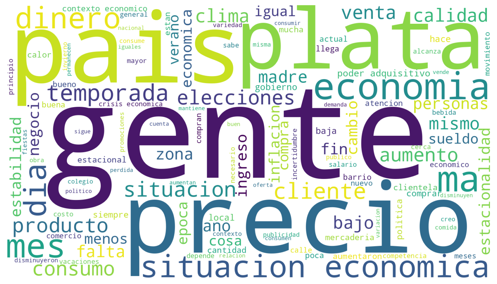
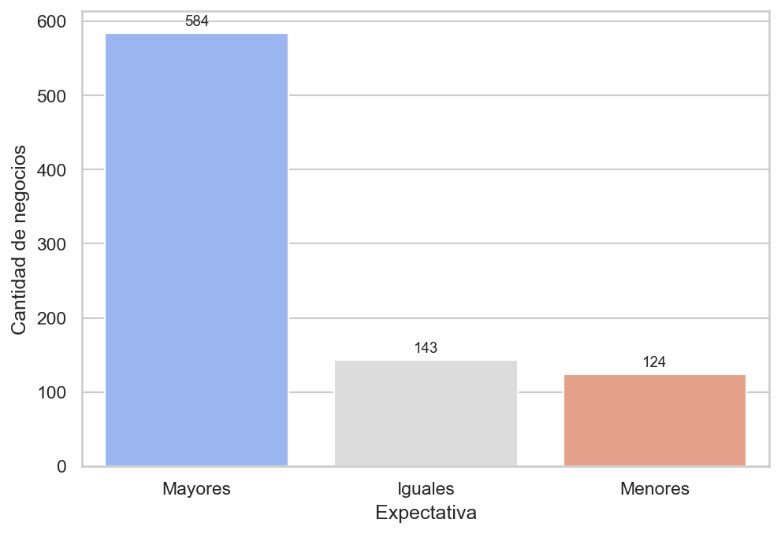
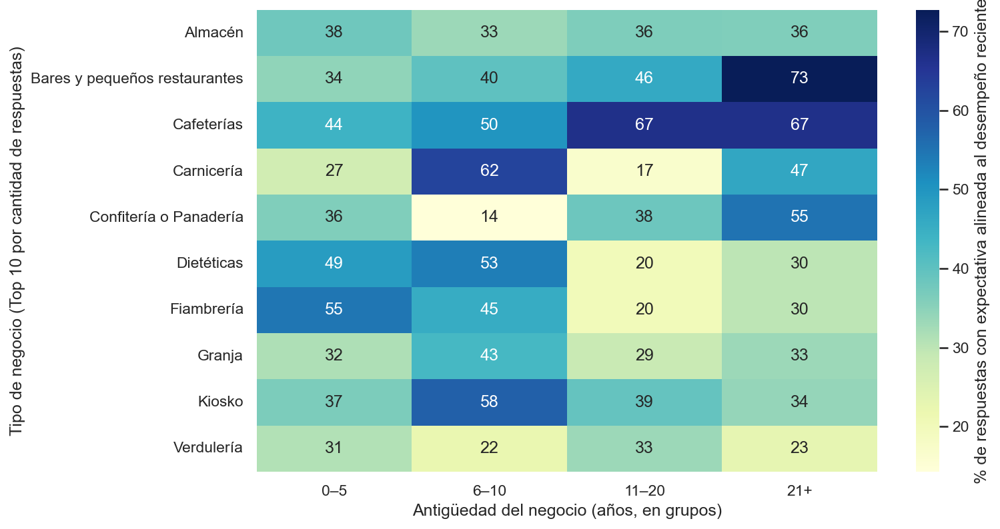

# Shocks coyunturales y dinámicas estacionales: evidencia de octubre de 2025 sobre expectativas y percepciones en nanostores de Argentina

## 1. Resumen

Los micro y pequeños negocios (MSEs), incluidos los nanostores, cumplen un rol central en el abastecimiento cotidiano de los barrios y en el empleo en América Latina. En Argentina, operan bajo alta volatilidad macroeconómica y enfrentan shocks de corto plazo que alteran el consumo y la toma de decisiones (MIT LIFT Lab, s. f.; INDEC, s. f.). Este informe analiza cómo conviven (i) estímulos estacionales asociados a fechas comerciales y (ii) incertidumbre coyuntural en las percepciones y expectativas de ventas de nanostores.

Para ello, se utilizan datos de encuestas recolectadas en el marco del MIT Low-Income Firms Transformation (LIFT) Lab, combinando análisis descriptivo y un análisis exploratorio de texto sobre respuestas abiertas (MIT LIFT Lab, s. f.). El objetivo no es probar causalidad, sino documentar patrones consistentes en una ventana temporal específica y proponer métricas operativas para profundizar el análisis. Se preservan “placeholders” de figuras para integrar visualizaciones (nube de palabras y gráficos de barras) que sintetizan los resultados principales.

--------------------------------------------------------------------------------
## 2. Introducción

Los nanostores (almacenes, kioscos, verdulerías y comercios de cercanía similares) son un componente clave de los sistemas de consumo barrial y de la economía cotidiana. Sin embargo, su escala reducida y su dependencia del flujo de caja diario los vuelve especialmente sensibles a cambios repentinos en la demanda, expectativas y precios. En contextos de inflación elevada, la gestión de inventario, la fijación de precios y la planificación de compras se vuelven decisiones de supervivencia (INDEC, s. f.).

En ese marco, octubre de 2025 resulta una ventana relevante para observar la superposición de señales estacionales (asociadas a picos de consumo por fechas comerciales, como el Día de la Madre) con un entorno de incertidumbre coyuntural (por ejemplo, cambios en expectativas macro y el clima político, como un proceso electoral). Este trabajo se concentra en cómo los comerciantes describen y anticipan el desempeño de su negocio: qué reportan sobre sus ventas recientes, qué esperan hacia adelante y qué razones mencionan en respuestas abiertas.

## 3. Datos y metodología

El análisis se basa en el relevamiento del MIT LIFT Lab, que utiliza instrumentos de encuesta para capturar indicadores operativos y percepciones de micro y pequeños negocios, combinando variables cuantitativas con preguntas cualitativas (MIT LIFT Lab, s. f.).

En particular, se trabaja con 923 respuestas correspondientes al periodo bajo estudio (octubre de 2025). El instrumento de encuesta releva, entre otros aspectos:

- La percepción del comerciante sobre cómo evolucionaron sus ventas respecto del mes previo.
- La expectativa de ventas en un horizonte de hasta 3 meses desde el momento en que se tomó la encuesta.
- Preguntas abiertas donde los encuestados explican, en sus propias palabras, las razones detrás de cambios en ventas y otras decisiones.
- Señales operativas complementarias (por ejemplo, precios e inventario) y características generales del negocio.

La estrategia analítica es descriptiva: se reportan distribuciones (gráficos de barras) y se analizan respuestas abiertas mediante técnicas simples de normalización de texto y frecuencia de términos (nubes de palabras). Este enfoque se alinea con el carácter exploratorio de un informe educativo y con la necesidad de interpretar el contexto sin sobre-extender conclusiones causales.

## 4. Preparación de datos (limpieza)

El proceso de limpieza inicial está documentado en el notebook [src/notebooks/0_initial_cleaning.ipynb](src/notebooks/0_initial_cleaning.ipynb) y tuvo como objetivo mejorar consistencia y comparabilidad entre respuestas. Dado el foco de este informe (expectativas, percepciones y texto), se priorizaron las siguientes acciones:

- Depuración de metadatos del instrumento: se removieron columnas técnicas de plataforma (por ejemplo, identificadores y marcas temporales) que no aportan al análisis.
- Normalización de variables de texto: se estandarizaron acentos/caracteres especiales y se homogeneizaron respuestas cortas (por ejemplo, variantes de “sí/si”) para evitar fragmentación artificial en el análisis de frecuencia.
- Parseo de variables numéricas con respuestas mixtas: se definieron reglas para separar o convertir entradas donde el encuestado combinó texto y números en una misma celda (por ejemplo, montos o consumos reportados en formatos heterogéneos).
- Tratamiento conservador de outliers evidentes: cuando un valor extremo luce incompatible con la escala típica de la variable y puede sesgar métricas agregadas, se lo trató como faltante para el análisis descriptivo.

Nota: el relevamiento también incluye información geográfica. Sin embargo, dado que este informe no desarrolla análisis territorial, esa dimensión no se discute en el cuerpo del trabajo.

## 5. Resultados: estacionalidad, incertidumbre y expectativas

### 5.1. Señales estacionales en el relato de los comerciantes (análisis de texto)

Las preguntas abiertas permiten observar cómo los comerciantes explican “por qué” subieron o bajaron las ventas. En un primer nivel, suelen aparecer términos generales (por ejemplo, referencias a “gente/clientes” o a la “situación económica”), coherentes con el contexto macro que enfrentan los hogares (INDEC, s. f.).

En octubre, también emergen términos asociados a dinámicas estacionales (por ejemplo, menciones a “madre”, “temporada” o “fin de mes”), que funcionan como señales narrativas de picos de consumo o cambios transitorios en la demanda. En paralelo, aparecen referencias a “elecciones” y a “precios”, que suelen asociarse en el discurso de los encuestados a incertidumbre, cautela o ajustes preventivos.

Figura 1. Términos más frecuentes en las razones declaradas de cambio en ventas.

Fuente: Elaboración propia con datos del MIT LIFT Lab (octubre de 2025).

Importante: este análisis corresponde a frecuencia de términos (no a un puntaje cuantitativo de sentimiento). Aun así, es útil para identificar qué temas dominan el relato y qué eventos o preocupaciones aparecen espontáneamente.

### 5.2. Expectativas de ventas a tres meses en contexto de volatilidad

Las expectativas de ventas a 3 meses muestran cómo los dueños proyectan su desempeño en un horizonte corto/medio. Un resultado relevante es que, incluso cuando el contexto se percibe incierto, suele persistir una fracción importante de respuestas optimistas (por ejemplo, “mayores”) que se asocia a la inercia estacional hacia fin de año.

Esta coexistencia —preocupación en el relato cualitativo y expectativa relativamente optimista— es consistente con la idea de que los nanostores aprenden a operar bajo volatilidad, apoyándose en patrones culturales de consumo (picos estacionales) como referencia práctica para planificar (MIT LIFT Lab, s. f.).

Figura 2. Distribución de la expectativa de ventas en un horizonte de 3 meses.

Fuente: Elaboración propia con datos del MIT LIFT Lab (octubre de 2025).

### 5.3. Consistencia entre expectativa y desempeño reciente (brecha expectativa–resultado)

Para conectar expectativas con resultados recientes, se construye un indicador simple de consistencia comparando:

- La expectativa de ventas a 3 meses (declarada al momento de la encuesta), y
- La percepción del desempeño reciente (ventas respecto del mes anterior).

La idea es estimar, por tipo de negocio y antigüedad (en grupos), qué tan alineadas están las expectativas con el desempeño reportado. Este indicador no pretende medir desempeño “real” (no hay auditoría de ventas), pero sí comparar consistencia interna entre percepción y proyección.

Figura 3. Porcentaje de coincidencia entre expectativa a 3 meses y desempeño reciente, por tipo y antigüedad del negocio.

Fuente: Elaboración propia con datos del MIT LIFT Lab (octubre de 2025).

## 6. Conclusiones y líneas de trabajo

En conjunto, los resultados describen un escenario típico del microcomercio de cercanía en contextos volátiles: el comerciante convive con señales contradictorias (estacionalidad comercial vs. incertidumbre coyuntural) y traduce esa tensión en decisiones prácticas. En las respuestas abiertas, aparecen menciones a eventos y al clima económico; en las expectativas, se observa una apuesta de corto plazo a la estacionalidad.

Como aporte principal, el informe propone operacionalizar esa tensión a través de una métrica simple de consistencia entre expectativas y percepciones. En iteraciones futuras, este enfoque podría ampliarse con:

- Un análisis cuantitativo formal (por ejemplo, modelos simples por rubro y antigüedad).
- Un análisis de texto más robusto (por ejemplo, clasificación temática o sentimiento, si se incorpora un método validado para español y se controlan sesgos).

--------------------------------------------------------------------------------
## 7. Referencias

- Brown, E. (2023, January 4). *Sustainable supply chains put the customer first*. MIT News. https://news.mit.edu/2023/sustainable-supply-chains-put-customer-first-josue-velazquez-martinez-0104
- Instituto Nacional de Estadística y Censos (INDEC). (s. f.). *Índice de precios al consumidor (IPC)*. Recuperado el 6 de enero de 2026, de https://www.indec.gob.ar/indec/web/Nivel4-Tema-3-5-31
- MIT LIFT Lab. (s. f.). *MIT Low-Income Firms Transformation (LIFT) Lab*. Recuperado el 6 de enero de 2026, de https://liftlab.mit.edu/
- Sánchez Trejo, V. G., Mora-Quiñones, C. A., & Tedesco, M. S. (2025). *Proceedings of the First International Conference – MIT LIFT Lab Research Fest - South America: Empowering the foundations of the Latin American economy to tackle regional and global challenges*. Instituto Tecnológico de Buenos Aires & MIT Low-Income Firms Transformation Lab. https://hdl.handle.net/20.500.14769/4981